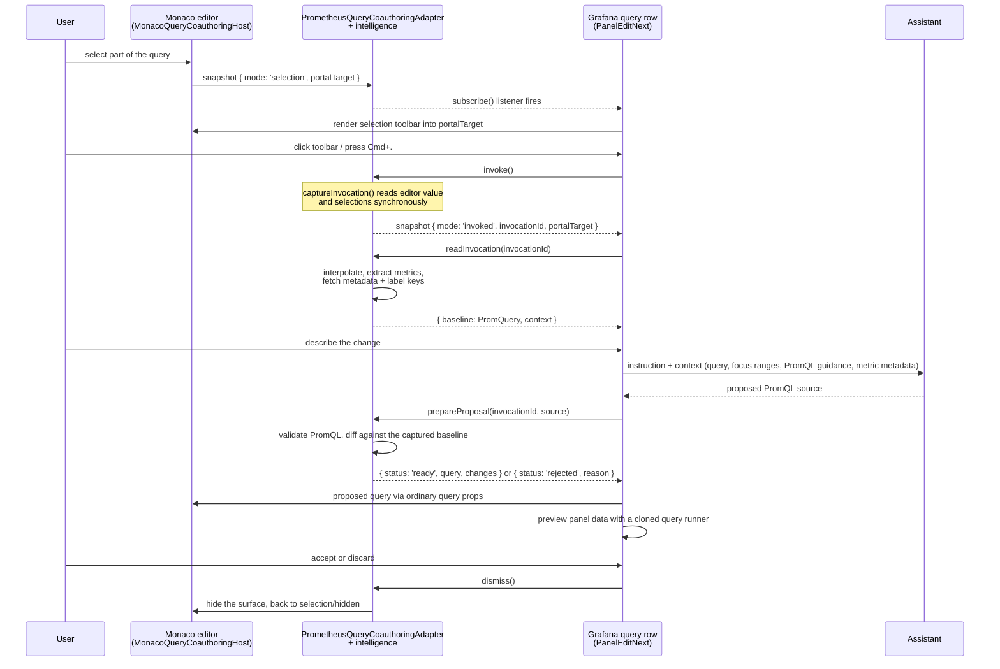

# Prometheus query coauthoring

Query coauthoring lets someone who already has a working PromQL query describe a change in words instead of
editing it by hand. They highlight part or all of the query, invoke coauthoring from the selection toolbar or
with `Cmd/Ctrl + .`, describe the change, preview the proposal against the panel, then accept or dismiss it.

The feature is a paired experiment: Grafana's PanelEditNext query row owns the user-facing transaction, and this
datasource owns only the Monaco- and PromQL-specific parts. It is gated in Core behind the
`queryeditor.coauthoringUi` feature toggle, and there is intentionally no row-level whole-query action.

## Boundary

This is a private bilateral PanelEditNext + Prometheus seam. Prometheus implements the row-scoped
`QueryEditorCoauthoringAdapterV1` supplied through the optional private query-editor prop
`unstable_queryEditorCoauthoringV1`. The adapter exposes six operations: snapshot, subscription, invocation,
invocation reading, proposal preparation, and dismissal.

| Owned by Core                                                 | Owned by Prometheus                                                   |
| ------------------------------------------------------------- | --------------------------------------------------------------------- |
| The React surface (selection toolbar, prompt, accept/discard) | The DOM node that surface is portalled into, and where it is anchored |
| Assistant requests and responses                              | The PromQL context those requests are grounded in                     |
| Panel preview, apply, and revert                              | PromQL validation and typed `PromQuery` construction                  |
| The query-row transaction and its lifetime                    | Reporting selection, invocation, and manual edits                     |

The datasource does not render coauthoring UI, mutate the editor for proposals, add Monaco proposal decorations,
or make the editor read-only. Core displays a proposal by passing the proposed `PromQuery` through the normal
query props, which is why a proposal appears in Monaco without this package touching the model.

## How data flows

The context handed to Core (and from there to the Assistant) is deliberately small: the query text, the
normalized focus ranges, a PromQL language descriptor with prompt guidance, and advisory metric metadata. It
carries no datasource identity, credentials, or panel data — Core supplies whatever else the Assistant needs.

### Context budgets

`intelligence.ts` bounds enrichment so one invocation cannot fan out into an expensive burst of requests:

- at most 20 metrics in the context
- label keys looked up for at most the first 5 of those metrics, at most 30 labels each
- metadata `help` truncated to 500 characters

Metadata and labels are optional in the contract. They can be absent because of these budgets, because a lookup
failed, or because Prometheus genuinely has no value. Enrichment failures are swallowed on purpose: the rest of
the context must still load.

## Modules

- `usePrometheusQueryCoauthoring.ts` contains the experiment's React lifecycle: Monaco attachment,
  current-value refs, adapter creation and disposal, Core registration, and style updates.
- `MonacoQueryCoauthoringHost.ts` owns selection settling, shortcut registration, portal anchoring, viewport
  positioning, and internal surface measurement. It contains no PromQL logic.
- `PrometheusQueryCoauthoringAdapter.ts` composes editor events and PromQL intelligence into the private row
  adapter.
- `intelligence.ts` captures an atomic typed baseline, expands focus ranges, enriches PromQL context, validates
  proposed PromQL, and constructs typed proposals and change summaries.
- `structure.ts` is the pure PromQL layer beneath it: lezer-based focus-range expansion, metric-name
  extraction, validation, and the token diff that turns a proposal into anchored, focus-classified changes.
- `internalCoauthoringContract.ts` is a private type-only copy of the Core contract. The two copies must stay
  structurally synchronized.

The first three live under [`../components/monaco-query-field`](../components/monaco-query-field/README.md)
because they depend on Monaco; the rest are Monaco-free and live here.

## Lifecycle invariants

- Invocation captures `editor.getValue()` synchronously, including unblurred edits.
- Context loading may be asynchronous, but a dismissed or replaced invocation cannot become current again.
- A Core-controlled query prop update is allowed so proposals can appear in Monaco without ending the session.
- A Monaco content change that differs from the current query prop is a genuine manual edit. It invalidates the
  invocation and immediately follows the normal query `onChange` path.
- Proposal preparation is pure with respect to Monaco. Stale, invalid, and unchanged proposals are rejected
  without editor mutation.

## Compatibility

The optional registration can be ignored safely: editors without it retain normal editing behavior. Core injects
it only for the `prometheus` plugin type; Amazon Managed Service for Prometheus remains outside this experiment
even though it reuses Prometheus editor modules. Because the prop is optional in both directions, older Core
omits it and older Prometheus ignores it, so mixed versions fall back to the ordinary query editor.

This paired architecture does not use an exposed component or `plugin.json` extension registration.

**Second datasource rule:** a second datasource must not copy this seam. It requires a reviewed, generalized
contract promoted to `@grafana/data` — as does turning this experiment into a supported plugin extension point.
